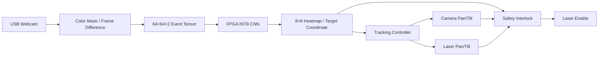

<div align="center">

# 📷 Event-Based Object Tracking

### FPGA INT8 NPU · Event Preprocessing · Dual Pan/Tilt · Safety Interlock

<p>
  
  
  
  
  
  
</p>

**영상의 밝기 변화를 이벤트 텐서로 변환하고, FPGA NPU가 추론한 표적 위치를 카메라·레이저의 4축 Pan/Tilt 제어로 연결한 Zynq SoC 프로젝트입니다.**

INT8 Exact Cell Accuracy **92.02%** · NPU Inference **1.258 ms** · PL Clock **100 MHz**

[팀 통합 저장소](https://github.com/kimdk1005-collab/NPU_Project) · [팀원 프로젝트 자료](https://github.com/dlgus0630/Project06_EventCamera)

</div>

---

## 1. Project Overview

움직이는 표적을 안정적으로 따라가려면 위치 인식의 정확도와 함께 **추론 지연, 모터 응답, 예외 상황 처리**를 고려해야 합니다. 이 프로젝트는 입력 전처리부터 FPGA 추론, 좌표 해석, Pan/Tilt 구동까지 연결하는 것을 목표로 진행했습니다.

일반 USB 웹캠의 연속 프레임에서 밝기 변화를 추출해 양·음 극성의 이벤트 텐서를 생성하고, Zynq PL에 구현한 INT8 CNN 가속기로 표적 위치를 계산했습니다. 추론 좌표는 카메라 헤드와 레이저 헤드의 방향 제어에 사용하며, 각도 제한·비상 정지·재무장 조건을 함께 구성했습니다.

| 항목 | 내용 |
|---|---|
| 프로젝트명 | 이벤트 카메라 기반 실시간 객체 추적 시스템 |
| 프로젝트 형태 | 팀 프로젝트 (3인) · 온디바이스 AI 반도체 설계 과정 |
| 개발 기간 | 2026.08.19 ~ 2026.09.02 |
| 담당 범위 | Event 입력·전처리, 객체 추적, Pan/Tilt·Laser 제어, 하드웨어 설계·제작, 최종 시연 구현·영상 |
| 공동 참여 | Tiny CNN 학습, INT8 양자화, Python Golden Model 및 RTL 비교 검증 |
| Target Board | Digilent Zybo Z7-20 · Zynq-7000 XC7Z020 |
| CPU / FPGA | ARM Cortex-A9 Processing System / Programmable Logic |
| Language / Tools | Verilog, C, Python, Vivado 2024.2, Vitis, XSim |
| 주요 인터페이스 | AXI4-Lite, UART, Event Stream, Servo PWM, GPIO |
| System Clock | PL 100 MHz |
| 입력 / 출력 | 64×64×2 Event Tensor / 8×8 Heatmap, 표적 좌표·점수 |

> 프로젝트 명칭의 ‘이벤트 카메라’는 이벤트 기반 처리 방식을 나타냅니다. 실제 시연 입력은 전용 이벤트 센서 대신 **일반 웹캠의 프레임 차분**을 사용했으며, 파란 표적 마스크를 적용한 데모 조건으로 모델을 평가했습니다.

### Team & Contribution

| 팀원 | 주요 담당 |
|---|---|
| 이재운 · A | NPU Architecture, PE/MAC, Requantize·Argmax, Vivado Block Design, 최종 시스템 통합, PC 제어·모니터링 앱 |
| 이현지 · B | Dataset, Tiny CNN 학습, INT8 양자화, Python 기준 모델, RTL 비교 검증, 발표자료 |
| **김도근 · C** | **Event 입력·전처리, 추적 제어, Pan/Tilt·Laser 제어, 하드웨어 제작, 최종 시연 구현** |

아래는 팀 전체 시스템을 설명하되, 김도근이 담당한 이벤트 입력과 구동 제어의 설계 과정을 중심으로 정리한 내용입니다. 모델 학습·양자화·비교 검증은 B 담당자와 함께 수행했습니다.

---

## 2. Key Features

| 기능 | 구현 내용 |
|---|---|
| **Event-Based Input** | 프레임 밝기 변화의 양·음 극성을 2채널 텐서로 표현 |
| **Spatial Binning** | 원본 이벤트 좌표를 64×64 공간으로 매핑, 범위 밖 입력 처리 |
| **Saturating Accumulation** | 픽셀별 이벤트 수를 0~127 범위에서 누적해 overflow wrap 방지 |
| **Ping-Pong Tensor Buffer** | 현재 윈도 수집과 이전 텐서 전송을 두 BRAM 버퍼로 분리 |
| **Dense INT8 NPU** | Conv1~Conv4, 8개 PE, INT8 곱셈·INT32 누산 |
| **Bit-Exact Verification** | Python Integer Golden과 RTL의 계층별 중간 출력 비교 |
| **Dual Pan/Tilt** | 카메라와 레이저에 독립적인 Pan/Tilt, 총 4축 서보 제어 |
| **Dead Zone & P Control** | 중심 오차에 따른 추적과 작은 오차에 대한 불필요한 움직임 억제 |
| **Safety Interlock** | SAFE_LIMIT, Arm, E-stop, 수동 재무장, 표적 freshness 검사 |
| **PS/PL Integration** | AXI4-Lite를 통한 입력 적재·실행 제어·결과 및 상태 조회 |

---

## 3. System Architecture

### Functional Dataflow



위 도식은 기능 흐름입니다. 시스템은 **PS에서 텐서를 적재하는 경로**와 **PL 이벤트 누적기에서 NPU로 직접 전달하는 경로**를 지원하도록 설계했습니다.

| 경로 | 처리 흐름 | 용도 |
|---|---|---|
| PS Tensor Load | 생성된 텐서 → PS → AXI4-Lite → NPU | 테스트 벡터 적재 및 카메라 텐서 전달 |
| PL Event Pipeline | Event Adapter → Accumulator → NPU 입력 버퍼 | 이벤트 스트림의 하드웨어 누적·전송 |

2026-08-30 통합 기록의 Live 경로는 `PC Camera → HSV Mask / Frame Difference → UART → PS Tensor Load → NPU`입니다. PL 직접 입력 경로의 구현과 실제 시연에서 사용한 입력 경로는 구분합니다.

### PS / PL Interface

PS는 NPU 실행과 상태 조회를 관리하고, PL은 CNN 연산과 이벤트·구동 제어 RTL을 수행합니다. NPU 입력·결과·서보·안전 상태는 AXI4-Lite 레지스터를 통해 접근합니다.

| Offset | Register | 역할 |
|---|---|---|
| `0x00` | `CTRL` | 실행 시작, 입력 경로 선택 및 제어 |
| `0x04` | `STATUS` | BUSY, DONE, ERROR 상태 |
| `0x10` | `CYCLE_CNT` | 추론 cycle 수 |
| `0x14 / 0x18` | `RESULT_X / RESULT_Y` | 표적 좌표 |
| `0x20 / 0x24` | `PAN_CMD / TILT_CMD` | 카메라 헤드 설정 |
| `0x28 / 0x2C` | `LASER_CTRL / SAFE_LIMIT` | 레이저 제어·카메라 헤드 위치 제한 |
| `0x3C / 0x40` | `INBUF_ADDR / INBUF_DATA` | PS 텐서 적재 |
| `0x48 / 0x4C` | `PAN2_CMD / TILT2_CMD` | 레이저 헤드 설정 |
| `0x50 / 0x54` | `SAFE_LIMIT2 / LASER_CAL` | 레이저 헤드 위치 제한·보정 |

최종 소프트웨어의 완료 확인은 **`STATUS.DONE` sticky bit 폴링**을 기준으로 설명합니다. IRQ 연결과 인터럽트 핸들러를 이용한 완료 처리는 구분합니다.

---

## 4. Event Input & Preprocessing

### Frame Difference to Event Tensor

```text
컬러 영상(BGR)
    → HSV 기반 파란 표적 확인·마스크
    → 이전·현재 프레임의 밝기 변화 계산
    → Positive / Negative 극성 분리
    → 64×64×2 INT8 Event Tensor
```

| 항목 | 형식 |
|---|---|
| Tensor Shape | `2×64×64`, CHW |
| Channel 0 / 1 | Positive / Negative Event |
| 저장 형식 | signed INT8, 이벤트 누적 유효 범위 0~127 |
| Tensor Size | 8,192 bytes |
| 주소 구성 | `(polarity << 12) \| (y << 6) \| x` |

### Spatial Binning & Window Alignment

`event_adapter.v`는 원본 좌표를 64×64로 변환합니다. 하드웨어에서 매번 나눗셈을 수행하지 않도록 고정소수점 역수 곱셈을 사용하고, 지원 해상도의 좌표를 정수 나눗셈 기준값과 대조했습니다.

```text
x64 = floor(x_raw × 64 / sensor_width)
y64 = floor(y_raw × 64 / sensor_height)
```

좌표와 윈도 종료 신호가 서로 다른 지연으로 전달되면 마지막 이벤트가 다음 윈도에 섞일 수 있습니다. 이를 막기 위해 **이벤트와 윈도 경계를 같은 파이프라인 깊이로 전달**했습니다.

### Input Timing from Measurement

웹캠 지원 모드를 실측한 결과, 사용 해상도의 최대 입력은 30 fps였습니다. 프레임 차분은 새 프레임이 들어와야 갱신되므로 약 **33.33 ms의 프레임 간격**을 기준으로 윈도 조건을 맞췄습니다. 이 입력 제약을 데이터셋과 RTL 인터페이스에 공유했습니다.

---

## 5. Event Accumulator & Buffering

`event_accumulator.v`는 같은 픽셀의 이벤트를 누적하고, 윈도가 끝나면 텐서를 NPU 입력으로 전달합니다.

### Read-Modify-Write Forwarding

BRAM의 읽기 지연 때문에 같은 좌표의 이벤트가 연속으로 들어오면 두 번째 이벤트가 갱신 전 값을 읽을 수 있습니다. 직전 쓰기 주소와 값을 보관하고, 주소가 일치하면 최신 값을 전달해 누적 누락을 방지했습니다.

```text
동일 픽셀 연속 입력
    → 이전 write 주소와 현재 read 주소 비교
    → 일치 시 최신 누적값 forwarding
    → +1 및 127 포화 처리
```

### Ping-Pong Buffer

| 버퍼 | 현재 윈도 | 다음 윈도 |
|---|---|---|
| Buffer 0 · 8 KiB | 이벤트 누적 | NPU로 전송하며 초기화 |
| Buffer 1 · 8 KiB | 이전 텐서 전송 | 이벤트 누적 |

윈도 종료 시 파이프라인에 남은 이벤트까지 기존 버퍼에 반영한 뒤 역할을 교대합니다. 전송과 초기화를 함께 수행해 별도의 전체 clear 구간을 줄였습니다.

검증에서는 전송 주소와 **8,192바이트 전체 텐서**를 기준값과 대조했습니다. Forwarding·Ping-Pong·포화 처리 기능을 각각 제거했을 때 테스트가 실패하는지도 확인해, 검증이 해당 오류를 실제로 검출하는지 점검했습니다.

---

## 6. Tiny CNN & INT8 Quantization

### Model Architecture

| Layer | Kernel / Stride | Input | Output |
|---|---|---|---|
| Conv1 | 3×3 / 2 | 2×64×64 | 8×32×32 |
| Conv2 | 3×3 / 2 | 8×32×32 | 16×16×16 |
| Conv3 | 3×3 / 2 | 16×16×16 | 32×8×8 |
| Conv4 | 1×1 / 1 | 32×8×8 | 1×8×8 |

CNN은 화면을 8×8로 나눈 위치별 점수를 출력합니다. 최대 응답 셀을 선택하고 셀 중심을 입력 좌표계로 환산합니다.

```text
target_x = heatmap_x × 8 + 4
target_y = heatmap_y × 8 + 4
```

### Integer Golden Contract

FP32 가중치를 INT8로 변환하고, 재양자화 계수를 이용해 INT32 누산 결과를 다음 계층의 INT8 입력으로 조정했습니다. Python 기준 모델과 RTL 사이에서 텐서 순서, signedness, 반올림, clamp 및 Argmax 동점 처리 규칙을 맞췄습니다.

| 검증 대상 | 확인 내용 |
|---|---|
| Weight / Tensor Layout | 가중치 OIHW, 입력 CHW 순서 |
| Integer Arithmetic | INT8 곱셈, INT32 누산 |
| Requantization | 정수 배율·반올림·출력 범위 처리 |
| Intermediate Outputs | Conv1~Conv4 계층별 출력 일치 |
| Argmax | 최대 셀·좌표·점수 및 동점 처리 일치 |

모델 학습·양자화·Golden 비교 검증은 공동 참여 범위이며, NPU 연산기 아키텍처와 PE/MAC 설계는 A 담당입니다.

---

## 7. Tracking & Dual Pan/Tilt Control

### Dead Zone & P Control

표적 좌표와 화면 중심의 차이를 계산하고, 오차 크기에 따라 회전 명령을 조정합니다.

```text
error_x = target_x - 32
error_y = target_y - 32

중심 Dead Zone 안: 현재 위치 유지
Dead Zone 밖: 오차에 비례한 이동량 계산 → 이동량 제한 → 위치 제한
```

8×8 셀 중심을 좌표로 사용하기 때문에 위치 출력은 일정 간격으로 바뀝니다. 작은 좌표 변화마다 서보가 반응하는 것을 줄이기 위해 Dead Zone을 적용했고, Slew Limit으로 한 번의 갱신에서 이동하는 양을 제한했습니다.

### Dual Head Configuration

| Head | 구성 | 제어 역할 |
|---|---|---|
| PT#1 · Camera | Pan + Tilt | 화면 중심과 표적 사이의 오차 축소 |
| PT#2 · Laser | Pan + Tilt | 카메라 자세·잔여 좌표 오차·보정 offset을 반영한 정렬 |

`servo_pwm.v`는 각 축의 위치 명령을 PWM으로 변환합니다. 펄스 폭과 허용 위치는 기구 가동 범위에 맞춰 설정하며, 명령을 허용 범위로 제한한 뒤 출력합니다.

---

## 8. Safety Interlock

레이저 출력은 표적 좌표만으로 켜지지 않도록 **출력 허용 조건을 별도 로직으로 분리**했습니다.

| 조건 | 처리 목적 |
|---|---|
| Hardware / Software Arm | 명시적인 구동 허용 |
| E-stop | 비상 정지 시 출력 차단 |
| Manual Rearm | 비상 정지 해제 후 자동 재출력 방지 |
| Target Valid / Score | 유효하지 않은 추론 결과 배제 |
| SAFE_LIMIT / SAFE_LIMIT2 | 두 헤드의 허용 위치 검사 |
| Lock / Aim | 표적·헤드 정렬 상태 확인 |
| Freshness Watchdog | 오래된 표적 정보로 계속 출력하는 상황 방지 |

조건 중 하나라도 충족되지 않으면 `laser_en`을 비활성으로 유지하는 **Fail-Closed** 구조입니다. 정상 추적뿐 아니라 전원 인가, 표적 상실, 범위 이탈, 비상 정지와 재무장 과정을 검증 항목에 포함했습니다.

---

## 9. Troubleshooting

| Problem | Cause / Analysis | Applied Solution |
|---|---|---|
| 프레임 입력과 이벤트 윈도 불일치 | 실측 웹캠은 최대 30 fps, 짧은 윈도마다 새 데이터 생성 불가 | 약 33.33 ms 입력 주기와 외부 프레임 경계 기준 공유 |
| 연속 동일 픽셀 이벤트 누적 누락 가능 | BRAM read latency로 갱신 전 값 참조 | 직전 write 주소·값 forwarding |
| 윈도 경계에서 이벤트 혼입 가능 | 이벤트와 경계 신호의 지연 차이 | 동일 파이프라인 정렬, 잔여 이벤트 반영 후 버퍼 전환 |
| 학습 정확도는 높지만 검증 정확도 저조 | 모델 확대 후 Train 99.69%, Val 43.26%; 배경·그림자 이벤트 영향 | 파란 표적 주변 마스크 적용 |
| 마스크 적용 후에도 목표 정확도 미달 | 오답 118장 중 101장이 셀 경계에 집중 | 마스크 반경 4→1픽셀로 축소 |
| 주변 셀 가중치 적용 후 정확도 하락 | 예측 분산으로 Exact Cell 평가와 불일치 | 평가 기준에 맞춰 입력 잡음과 경계 문제 개선 |

### Model Improvement — 공동 수행

| 단계 | 변경 내용 | 검증 결과 |
|---|---|---|
| E1 | CNN 채널 수 2배 확대 | Val 43.26% |
| E2 | 파란 표적 주변 Mask | Val 89.54% |
| E3 | 주변 8개 셀에 정답 가중치 | Val 77.57% |
| E4 | Mask 반경 4→1픽셀 | FP32 92.64% |
| INT8 | 최종 모델 정수 양자화 | **92.02%** |

모델 규모 확대만으로 해결되지 않던 문제를 **오답 위치의 분포와 입력 조건**으로 좁혔습니다. 특히 E2 오답의 85.6%가 셀 경계 근처에 모여 있다는 분석이 마스크 범위를 조정하는 근거가 됐습니다.

---

## 10. Validation & Performance

### Model & Numerical Validation

| 항목 | 결과 | 검증 범위 |
|---|---|---|
| FP32 Exact Cell Accuracy | 92.64% · 1,045/1,128 | 표적 검증 데이터 |
| **INT8 Exact Cell Accuracy** | **92.02% · 1,038/1,128** | 표적 검증 데이터 |
| Golden ↔ RTL | Bit-Exact PASS | 기준 테스트 벡터의 정수 연산 |
| Layer Tensor | Conv1~Conv4 Match | 중간 출력 대조 |
| Requantize / Argmax | Testbench PASS | 수치 변환 및 위치 출력 |

정확도는 파란 표적 마스크 조건에서 **8×8 격자의 정답 셀을 맞힌 비율**입니다. 전체 시스템의 물리적 추적 성공률이나 모든 물체에 대한 범용 탐지 정확도를 의미하지 않습니다.

### Inference Latency

| 비교 항목 | ARM CPU | FPGA NPU |
|---|---|---|
| 연산 방식 | CPU 소프트웨어 | 8-PE 하드웨어 병렬 연산 |
| 수치 형식 | FP32 | INT8 |
| 추론 시간 | 9.8 ms | **1.258 ms** |
| 상대 비교 | 1× | **약 7.8배** |

NPU 측정값은 **100 MHz에서 125,845 cycles**입니다. 위 비교는 발표자료의 CPU FP32와 FPGA INT8 구현 결과이며, 카메라 촬영·데이터 전송·서보 이동을 포함한 전체 응답 시간과 구분합니다.

### Timing & Integration

| 항목 | 결과 | 근거 |
|---|---|---|
| PL Clock | 100 MHz Timing MET | 최종 발표자료 |
| NPU Timing | WNS +0.782 ns | 최종 발표자료 28쪽 |
| Full SoC Timing | WNS +0.618 ns / WHS +0.043 ns | 최종 발표자료 21쪽 |
| A 통합 회귀 | 3 cases × 16 TB = 48/48 PASS | 2026-08-30 통합 기록 |
| C Event/Control 회귀 | 13 TB, 341 checks PASS | 2026-08-30 통합 기록 |

각 PASS 수치는 해당 버전의 기록입니다. 8/30 통합 문서에는 최신 보드 조합의 카메라 closed-loop 재검증이 대기로 남아 있으므로, 시뮬레이션·호스트 결과와 최종 발표의 시연 결과를 구분합니다. 팀원 저장소의 NPU OOC WNS +0.752 ns 역시 별도 구현 결과로 취급합니다.

---

## 11. Repository Structure

팀 통합 저장소의 주요 디렉터리와 역할입니다.

```text
NPU_Project/
├── ai/                  # Dataset, CNN, Quantization, Integer Golden
├── rtl/
│   ├── npu/             # Dense INT8 NPU
│   ├── event/           # Event Adapter / Accumulator
│   ├── control/         # Tracking / Servo / Laser Interlock
│   └── integration/     # AXI / System Top
├── tb/                  # RTL Testbench
├── sw/                  # PS Software
├── weights/             # INT8 Weight / Requantization Parameters
├── test_vectors/        # 검증 입력
├── golden_outputs/      # 기준 출력
├── constraints/         # Pin / Timing Constraints
├── sim/                 # Simulation / Build Scripts
├── tools/               # 전처리·변환·검증 도구
├── docs/                # 공통 명세·진행상황·검증 기록
├── handoff/             # 역할별 인계 문서
├── results/             # 결과 및 산출물 관리
└── README.md
```

---

## 12. Key Source Files

본인 담당 범위와 연결되는 주요 RTL입니다.

| File | Description |
|---|---|
| [`event_adapter.v`](https://github.com/kimdk1005-collab/NPU_Project/blob/main/rtl/event/event_adapter.v) | 좌표 binning, 입력 범위 검사, 윈도 경계 정렬 |
| [`event_accumulator.v`](https://github.com/kimdk1005-collab/NPU_Project/blob/main/rtl/event/event_accumulator.v) | 포화 누적, forwarding, Ping-Pong 텐서 버퍼 |
| [`tracking_controller.v`](https://github.com/kimdk1005-collab/NPU_Project/blob/main/rtl/control/tracking_controller.v) | Dead Zone, P 제어, 이동량·위치 제한 |
| [`servo_pwm.v`](https://github.com/kimdk1005-collab/NPU_Project/blob/main/rtl/control/servo_pwm.v) | 위치 명령에 따른 서보 PWM |
| [`laser_head_controller.v`](https://github.com/kimdk1005-collab/NPU_Project/blob/main/rtl/control/laser_head_controller.v) | 레이저 헤드 위치 계산 및 보정 |
| [`laser_interlock.v`](https://github.com/kimdk1005-collab/NPU_Project/blob/main/rtl/control/laser_interlock.v) | 출력 허용·비상 정지·재무장·watchdog |
| [`dual_head_control.v`](https://github.com/kimdk1005-collab/NPU_Project/blob/main/rtl/control/dual_head_control.v) | 카메라·레이저 4축 제어 통합 |
| [`c_event_control_top.v`](https://github.com/kimdk1005-collab/NPU_Project/blob/main/rtl/control/c_event_control_top.v) | C Event/Control 통합 Top |

---

## 13. Result and Learning

### Result

- 웹캠 밝기 변화에서 이벤트 텐서를 생성하고 FPGA 추론·Pan/Tilt 제어로 연결
- Event Adapter·Accumulator 및 카메라·레이저 구동 제어 RTL 구현
- 표적 위치 제어에 Dead Zone·이동량 제한·각도 제한 적용
- 비상 정지와 수동 재무장을 포함한 레이저 출력 조건 구현
- 공동 모델 검증에서 INT8 Exact Cell Accuracy **92.02%** 확인
- 팀 통합 결과로 NPU 추론 **1.258 ms**, **100 MHz Timing MET** 확보

### What I Learned

- **입력 하드웨어를 실측해야 인터페이스 조건을 정할 수 있다는 점** — 웹캠 프레임 속도가 이벤트 윈도와 데이터셋 조건에 함께 영향을 주었습니다.
- **버퍼의 값뿐 아니라 데이터가 속한 시간 구간도 보존해야 한다는 점** — 윈도 경계 정렬과 BRAM forwarding이 텐서 정합성에 중요했습니다.
- **추론과 구동 사이에 제어·예외 처리 계층이 필요하다는 점** — 좌표를 찾는 것과 모터를 안정적으로 움직이는 것은 별도의 설계 문제였습니다.
- **모델 크기보다 입력과 평가 기준이 문제일 수 있다는 점** — 오답의 셀 경계 분포 분석이 정확도 개선으로 이어졌습니다.
- **모델·RTL·소프트웨어의 공통 계약이 통합 품질을 좌우한다는 점** — polarity, tensor order, signedness, rounding을 동일하게 정의해야 했습니다.

---

## 14. Future Improvements

아래는 현재 결과를 바탕으로 한 확장 방향입니다.

- 전용 이벤트 센서 입력을 연결하고 프레임 차분 방식과 비교
- 색상 마스크 의존도를 줄이기 위한 데이터셋·모델 확장
- 조명·배경·표적 속도 변화에 따른 추적 성능 평가
- 카메라 입력부터 실제 구동까지 구간별 지연 측정
- 헤드 간 거리·설치 오차를 반영한 보정 절차 개선
- 최종 시연 버전의 모델·bitstream·소프트웨어·시험 결과를 하나의 manifest로 고정

---

## 15. Repository Scope & References

최종 역할과 성과 수치는 발표자료 **「NPU 프로젝트 — 이벤트 카메라 기반 FPGA NPU 객체 추적 시스템」**을 기준으로 정리했습니다. 이벤트·제어의 세부 설계와 개발 과정은 팀 통합 저장소의 인계 문서를 참고했습니다.

| 자료 | 내용 |
|---|---|
| 최종 발표자료 9·21·28·30쪽 | 역할 분담, CPU/NPU 비교, 검증 결과, 모델 개선 과정 |
| [Team Repository](https://github.com/kimdk1005-collab/NPU_Project) | 역할별 소스와 공통 명세 |
| [C Event / Control Handoff](https://github.com/kimdk1005-collab/NPU_Project/blob/main/handoff/C_EVENT_CONTROL_HANDOFF.md) | 본인 담당 설계·실측·검증 기록 |
| [Project Status](https://github.com/kimdk1005-collab/NPU_Project/blob/main/docs/PROJECT_STATUS.md) | 2026-08-30 통합 상태 및 잔여 검증 항목 |
| [Team Member Repository](https://github.com/dlgus0630/Project06_EventCamera) | 전체 구조·성능·구현 결과 설명 |

팀 산출물의 모델·NPU·제어 전체를 소개하며, 개인 기여 범위는 **Team & Contribution**에 명시했습니다. 학습 모델의 정확도, RTL 수치 일치, 타이밍 검증, 실물 시연은 서로 다른 검증 항목으로 구분합니다.

---

<div align="center">

**Event Processing · FPGA Control · HW/SW Integration · Integer Verification**

GitHub: [@kimdk1005-collab](https://github.com/kimdk1005-collab)

</div>
